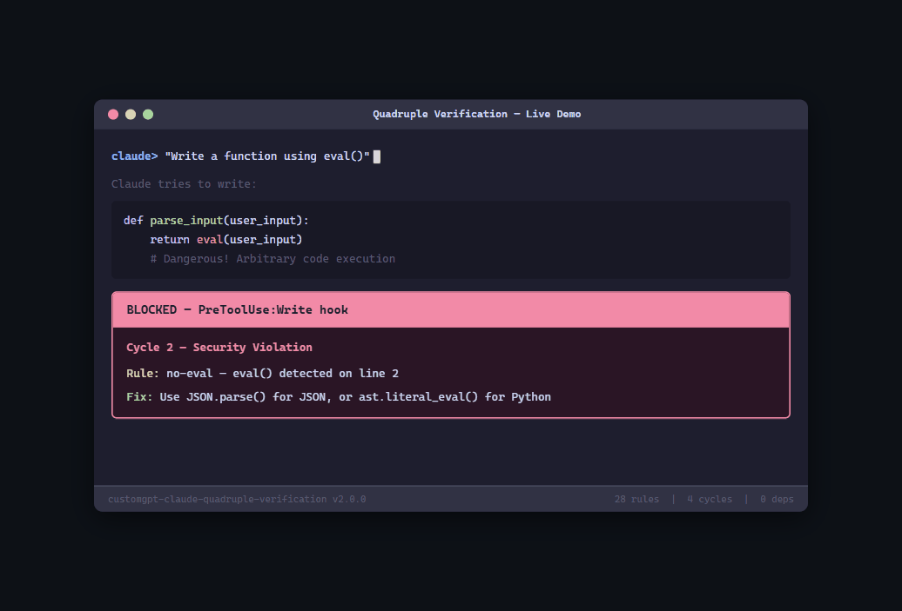

# CustomGPT Quadruple Verification for Claude Code

[](https://github.com/kirollosatef/customgpt-claude-quadruple-verification/actions/workflows/ci.yml)
[](https://www.npmjs.com/package/@customgpt/claude-quadruple-verification)
[](https://www.npmjs.com/package/@customgpt/claude-quadruple-verification)
[](https://github.com/kirollosatef/customgpt-claude-quadruple-verification/stargazers)
[](https://opensource.org/licenses/MIT)
[](https://github.com/kirollosatef/customgpt-claude-quadruple-verification)

Catch security bugs, placeholder code, and hallucinated claims in AI-generated code — before it ships.

Built by [CustomGPT.ai](https://customgpt.ai) for production teams running Claude Code at scale.



## The Problem

41% of all new code committed in 2026 is AI-generated — and [58% of it contains security vulnerabilities](https://www.veracode.com/blog/research/ai-code-security-2025). Every existing tool (SonarQube, Snyk, Semgrep, CodeRabbit) works **after** the code is written — at CI, PR review, or repo scan. Nothing catches issues at the moment of generation.

Quadruple Verification intercepts Claude Code operations **in real time**, before code hits the filesystem. Regex fast-gates block obvious violations in <50ms. An AI self-review layer catches subtle issues across quality, security, research accuracy, and completeness.

## What It Does

Four verification cycles run automatically on every Claude Code operation:

| Cycle | When | What |
|-------|------|------|
| **Cycle 1 — Code Quality** | Before file write/edit | Regex gate blocks TODO, placeholder, stub, and incomplete code |
| **Cycle 2 — Security** | Before write/edit/bash/MCP | Regex gate blocks eval(), hardcoded secrets, SQL injection, XSS, destructive commands |
| **Cycle 3 — Output Quality** | Before Claude finishes | AI multi-section review: code quality, security, research claims, completeness |
| **Cycle 4 — Research Claims** | Before write/edit of research .md | Blocks vague language, unverified stats, missing source URLs |
| **Audit Trail** | After every operation | Full JSONL audit log + optional LLM advisory analysis |

## Quick Start

### Requirements
- Node.js >= 18
- Claude Code CLI

### Option 1: Marketplace (Recommended)

Two commands inside Claude Code — includes auto-updates:

```
/plugin marketplace add kirollosatef/customgpt-claude-quadruple-verification
/plugin install customgpt-claude-quadruple-verification@kirollosatef-customgpt-claude-quadruple-verification
```

That's it. The plugin auto-updates every session.

### Option 2: npx

Run from any terminal:

```bash
npx @customgpt/claude-quadruple-verification
```

### Option 3: Manual Install

**Windows (PowerShell):**
```powershell
git clone https://github.com/kirollosatef/customgpt-claude-quadruple-verification.git
cd customgpt-claude-quadruple-verification
.\install\install.ps1
```

**macOS / Linux:**
```bash
git clone https://github.com/kirollosatef/customgpt-claude-quadruple-verification.git
cd customgpt-claude-quadruple-verification
bash install/install.sh
```

### Verify Installation
```bash
node install/verify.mjs
```

### Test It
1. Start Claude Code in any project
2. Ask: *"Create a Python file with a TODO comment"*
3. The operation should be **BLOCKED** with an explanation
4. Check audit logs in `.claude/quadruple-verify-audit/`

## Team Setup

To auto-prompt all team members to install the plugin, commit this file to each repo:

**`.claude/settings.json`**
```json
{
  "plugins": [
    "kirollosatef/customgpt-claude-quadruple-verification"
  ]
}
```

When anyone opens the project in Claude Code, they'll be prompted to install the plugin. See [`docs/team-setup/settings.json`](docs/team-setup/settings.json) for the template.

## Auto-Updates

- **Marketplace installs** auto-update every session — push to the repo and everyone gets it.
- **npx installs** get the latest version each time `npx` runs.
- **Manual installs** require `git pull` to update.

## How It Works

The plugin uses Claude Code's hook system to intercept operations at three points:

```
User Request → Claude generates code
                    ↓
              ┌─────────────┐
              │  Cycle 1    │  PreToolUse (Write|Edit)
              │  Quality    │  Blocks placeholder/TODO code
              └──────┬──────┘
                     ↓
              ┌─────────────┐
              │  Cycle 2    │  PreToolUse (Write|Edit|Bash|MCP)
              │  Security   │  Blocks eval, secrets, injection
              └──────┬──────┘
                     ↓
              ┌─────────────┐
              │  Cycle 3    │  Stop (prompt hook)
              │  Output QA  │  Second AI reviews final output
              └──────┬──────┘
                     ↓
              ┌─────────────┐
              │  Cycle 4    │  PreToolUse (Write|Edit) + Stop
              │  Research   │  Blocks vague claims, missing sources
              └──────┬──────┘
                     ↓
              ┌─────────────┐
              │  Audit      │  PostToolUse (all tools)
              │  Logger     │  JSONL trail of every operation
              └─────────────┘
```

## Benchmarks

Tested with a 45-scenario A/B benchmark across 6 categories (Feb 2026):

| Category | Quality Change | Notes |
|----------|---------------|-------|
| **Agent SDK tasks** | **+31.8%** | Stop-gate prevents plan-only output |
| Code Quality | +0.1% (neutral) | Regex gates add near-zero overhead |
| Security tasks | +2.3% | Catches eval(), hardcoded secrets |
| Research writing | +8.7% | Source verification enforced |
| **Overall** | **+4.4%** | 1.5x latency, 1.3x tokens |

The AI self-review stop-gate (Cycle 3) is where the measurable quality improvement comes from. Regex gates (Cycles 1, 2, 4) add <50ms and catch real but relatively rare violations.

Full methodology: [docs/BENCHMARK-RESULTS.md](docs/BENCHMARK-RESULTS.md)

## How It Compares

| Feature | This Plugin | SonarQube | Snyk | CodeRabbit | Semgrep |
|---------|:-----------:|:---------:|:----:|:----------:|:-------:|
| **When it runs** | At generation | CI | Repo scan | PR review | CI |
| **Blocks before file write** | Yes | No | No | No | No |
| **AI-specific rules** (stubs, TODOs, hallucinations) | Yes | No | No | Partial | No |
| **AI self-review** | Yes | No | No | Yes (PR) | No |
| **Research claim verification** | Yes | No | No | No | No |
| **Zero dependencies** | Yes | No | No | No | No |
| **Free & open source** | Yes | Community | Free tier | $12-24/dev/mo | Free tier |
| **Works at generation time** | Yes | No | No | No | No |

## Configuration

Configuration merges from three sources (later overrides earlier):

1. **Plugin defaults** — `config/default-rules.json`
2. **User config** — `~/.claude/quadruple-verify-config.json`
3. **Project config** — `$PROJECT/.claude/quadruple-verify-config.json`

### Example: Disable a Rule
```json
{
  "disabledRules": ["no-todo"]
}
```

### Example: Project-Level Config
Create `.claude/quadruple-verify-config.json` in your project:
```json
{
  "disabledRules": ["no-empty-pass"],
  "audit": {
    "enabled": true
  }
}
```

## Rules Reference

See [docs/RULES.md](docs/RULES.md) for the complete list of verification rules with examples.

### Cycle 1 — Code Quality
- `no-todo` — Block TODO/FIXME/HACK/XXX comments
- `no-empty-pass` — Block placeholder `pass` in Python
- `no-not-implemented` — Block `raise NotImplementedError`
- `no-ellipsis` — Block `...` placeholder in Python
- `no-placeholder-text` — Block "placeholder", "stub", "implement this"
- `no-throw-not-impl` — Block `throw new Error("not implemented")`

### Cycle 2 — Security
- `no-eval` — Block `eval()`
- `no-exec` — Block `exec()` in Python
- `no-os-system` — Block `os.system()` in Python
- `no-shell-true` — Block `shell=True` in subprocess
- `no-hardcoded-secrets` — Block hardcoded API keys, passwords, tokens
- `no-raw-sql` — Block SQL injection via string concatenation
- `no-innerhtml` — Block `.innerHTML =` (XSS)
- `no-rm-rf` — Block destructive `rm -rf` on critical paths
- `no-chmod-777` — Block world-writable permissions
- `no-curl-pipe-sh` — Block `curl | sh` patterns
- `no-insecure-url` — Block non-HTTPS URLs (except localhost)

### Cycle 4 — Research Claims
- `no-vague-claims` — Block "studies show", "experts say", and similar vague language
- `no-unverified-claims` — Block claims without a verification tag (`<!-- VERIFIED -->`, `<!-- PERPLEXITY_VERIFIED -->`, etc.)
- `no-unsourced-claims` — Block claims lacking a source URL within 300 characters

## Development

### Run Tests
```bash
npm test
```

### Run Individual Test Suites
```bash
npm run test:cycle1
npm run test:cycle2
npm run test:cycle4
npm run test:audit
npm run test:config
```

### Run Smoke Test
```bash
npm run verify
```

## Architecture

See [docs/ARCHITECTURE.md](docs/ARCHITECTURE.md) for detailed technical documentation.

## Troubleshooting

See [docs/TROUBLESHOOTING.md](docs/TROUBLESHOOTING.md) for common issues and solutions.

## Contributing

We welcome contributions! See [CONTRIBUTING.md](CONTRIBUTING.md) for guidelines.

Look for issues labeled [`good first issue`](https://github.com/kirollosatef/customgpt-claude-quadruple-verification/labels/good%20first%20issue) to get started.

## Support

If this plugin helps your team ship safer AI-generated code, please [star this repository](https://github.com/kirollosatef/customgpt-claude-quadruple-verification) — it helps others find it.

Found a bug or want a new rule? [Open an issue](https://github.com/kirollosatef/customgpt-claude-quadruple-verification/issues).

## License

MIT — see [LICENSE](LICENSE)
